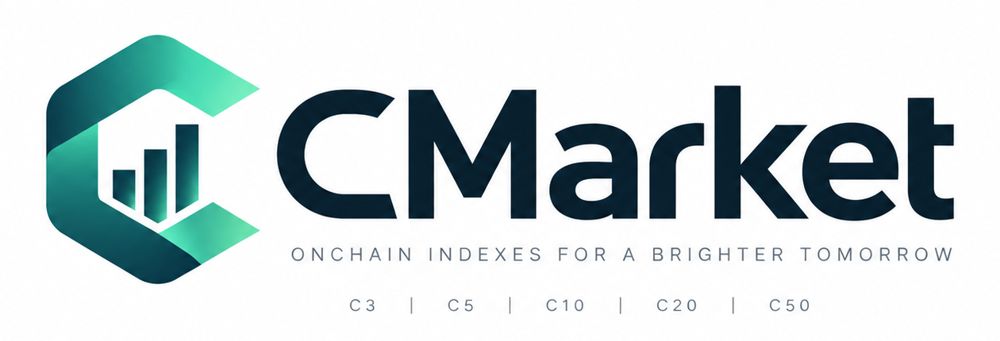

# C Market

<p align="center">
  
</p>

> A mobile-first, on-chain basket experience for the Solana Mobile ecosystem.

C Market is an experimental Android application designed for Seeker users who want a simple, transparent way to explore predefined crypto-asset baskets such as C3, C10, and future basket sizes.

The project is being prepared for **CLOCK IN — A Solana Mobile Hackathon**.

## Product concept

C Market turns a complex multi-asset purchase flow into a focused mobile experience:

1. The user selects a basket.
2. The user reviews the basket composition and methodology.
3. The user connects a Solana wallet through Mobile Wallet Adapter.
4. The user reviews the amount and destination before signing.
5. The user approves the transaction in the wallet.
6. The app displays the confirmed signature and a Solana Explorer link.
7. The user can return to the app to review the basket and transaction receipt.

The product is designed around transparency, mobile-native approval, clear confirmations, and repeatable basket discovery.

## Current prototype status

The repository now contains an initial Expo/React Native mobile foundation with:

- Android-first C Market screens.
- A working C3 prototype with future basket sizes clearly marked as upcoming.
- Mobile Wallet Adapter wallet connection.
- Devnet USDC balance lookup.
- C3 Devnet USDC purchase flow.
- Transaction confirmation and Explorer links.
- Hackathon compliance, demo, security, and release documentation.

The earlier local prototype also demonstrated the following flow on Solana Devnet:

- Android/Seeker development-client execution.
- Phantom connection through Mobile Wallet Adapter.
- Devnet USDC balance verification.
- A $5 minimum test purchase.
- Wallet approval and transaction confirmation.
- USDC transfer to the configured Devnet treasury.
- Confirmation feedback inside the app.
- Solana Explorer transaction verification.

Reference transaction from the prototype demonstration:

[View the Devnet transaction](https://explorer.solana.com/tx/4GNY8qQT6gPVKx1JHZUekfxyxjXHnWskeaBUy2RoRgvUvuH5jaNdnxcCKtHWqbHh4EkKLvmyZSu2Ssni44iPWTGk?cluster=devnet)

### Important prototype limitation

The current demonstration proves payment routing and confirmation. It does **not** yet prove a production-ready, atomic distribution of the treasury balance into every underlying basket constituent.

Until that module is implemented and tested, the interface must describe the transaction accurately as a recorded Devnet purchase/payment. It must not claim that a final basket allocation has already occurred.

Devnet assets have no real-world value. The prototype is not ready for mainnet funds or public financial use.

## Why this is a strong Solana Mobile project

C Market is designed specifically for a mobile wallet environment:

- Wallet approval happens inside a compatible mobile wallet.
- The confirmation flow is optimized for a small screen.
- The user sees the amount, network, destination, and transaction status before continuing.
- The app uses Mobile Wallet Adapter instead of asking users to expose private keys.
- The product can support repeat engagement through basket discovery, portfolio activity, methodology updates, and transparent on-chain history.
- The Seeker is treated as a primary product environment, not merely as a web wrapper.

## CLOCK IN judging alignment

| Criterion                         | C Market response                                                                                                                               |
| --------------------------------- | ----------------------------------------------------------------------------------------------------------------------------------------------- |
| Stickiness and product-market fit | Repeatable basket discovery, simple purchase flow, transaction receipts with Explorer evidence, and a product designed for Solana Mobile users. |
| User experience                   | Focused Android flow, wallet-native approval, clear summaries, strong error states, and Explorer verification.                                  |
| Innovation / X-Factor             | A mobile-first basket layer that makes diversified on-chain exposure easier to understand and interact with.                                    |
| Presentation and demo             | A short, verifiable demo: connect, review, approve, confirm, and inspect the transaction on Explorer.                                           |

## Repository structure

```text
apps/mobile/                 Expo/React Native application source
docs/                        Architecture, compliance, demo, and release documents
submission/                  Final submission material checklist
.github/workflows/           Repository hygiene checks
.env.example                 Safe configuration template
```

## Local development

```bash
cd apps/mobile
cp ../../.env.example .env
npm ci
npm run android
```

Mobile Wallet Adapter uses native Android modules, so the app must run through a custom Expo development build rather than Expo Go.

The mobile runtime reads its public configuration through `apps/mobile/constants/app-config.ts`. The required variables are `EXPO_PUBLIC_SOLANA_CLUSTER`, `EXPO_PUBLIC_SOLANA_RPC_URL`, `EXPO_PUBLIC_DEVNET_USDC_MINT`, `EXPO_PUBLIC_USDC_DECIMALS`, `EXPO_PUBLIC_DEVNET_TREASURY_PUBLIC_KEY`, `EXPO_PUBLIC_APP_NAME`, and `EXPO_PUBLIC_APP_IDENTITY_URI`. The app validates them at startup. Keep the local `apps/mobile/.env` file untracked.

The development environment should use Solana Devnet until the application has a tested, reviewed, and explicitly approved production configuration.

Never place a seed phrase, private key, wallet export, signing credential, or secret RPC key in this repository.

## Required work before submission

- Replace the placeholder application icon with an approved C Market asset.
- Add final local Android signing credentials and verify the signed APK that judges can install.
- Complete the basket allocation logic or clearly limit the product claims to the functionality actually implemented.
- Add persistent activity/history in a later product phase; do not claim it exists yet.
- Test rejected signatures, insufficient USDC, insufficient SOL, wrong network, RPC failures, duplicate taps, and interrupted sessions.
- Produce the demo video.
- Produce the pitch deck or brief presentation.
- Complete the compliance checklist in [docs/HACKATHON_COMPLIANCE.md](docs/HACKATHON_COMPLIANCE.md).
- Run the release checklist in [docs/RELEASE_CHECKLIST.md](docs/RELEASE_CHECKLIST.md).

## Legal and product disclaimer

C Market is an experimental software project. Nothing in this repository is investment advice, an offer, a solicitation, a security, a deposit, a guarantee of returns, or a promise of profit. Users can lose digital assets. The project should only use test assets during development and must comply with applicable law before any production deployment.

## Official references

- [CLOCK IN official website](https://solanamobile.radiant.nexus/)
- [CLOCK IN terms and conditions](https://solanamobile.radiant.nexus/legal/clock-in-terms.pdf)
- [Solana Mobile documentation](https://docs.solanamobile.com/)
- [Mobile Wallet Adapter documentation](https://docs.solanamobile.com/solana-mobile-stack/mobile-wallet-adapter)
- [React Native Wallet UI quickstart](https://docs.solanamobile.com/get-started/react-native/quickstart)
- [Solana Mobile dApp Store documentation](https://docs.solanamobile.com/dapp-store/intro)
